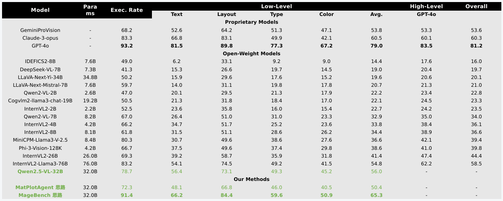

# MultiTurnChartCoder

## 项目说明
本项目主要实现了以下内容：

1. 复现 ChartMimic Benchmark
   - 实现数据集的读取和评估（仅包含 Low-level 评估，因为 High-level 评估需要调用 GPT-4 API，成本较高）
   - 基于 vLLM 本地部署 Qwen2.5-VL 模型进行测评
   - 结果显示 Qwen2.5-VL 全面超越其他开源模型

2. 复现 MatPlotAgent 方案
   - 使用两个 VLM 模型（均采用 Qwen2.5-VL）
   - 一个模型负责代码生成，另一个提供反馈
   - 通过多轮迭代优化图表代码
   - 实验效果：相比 Qwen2.5-VL Baseline 有所下降

3. 复现 MageBench 方案
   - 使用单个 VLM 模型
   - 将执行后的代码结果反馈给模型
   - 通过多轮迭代优化图表代码
   - 实验效果：相比 Qwen2.5-VL Baseline 有明显提升

## 实验结果


## 代码文件说明
- `vllm_start.sh`: 启动 vLLM 服务，用于本地部署大模型（可视为 Ollama 的替代品）
- `chart_coder_agent.py`: MatPlotAgent 方案实现
- `chart_coder_agent_multi_process.py`: MatPlotAgent 方案的多进程版本
- `chart_coder_agent_single_vlm.py`: MageBench 方案实现
- `chart_coder_agent_single_vlm_multi_process.py`: MageBench 方案的多进程版本
- `chartmimic_benchmark.py`: ChartMimic 数据集的读取和评估

## 快速开始（并没有封装好，代码里面需要手动修改路径之类的）
1. 启动 vLLM 服务：
```bash
bash vllm_start.sh
```

2. 运行推理：
```bash
python chart_coder_agent_multi_process.py   # 在里面选择 MatPlotAgent 或者 MageBench 方案
```

3. 运行评估：
```bash
python chartmimic_benchmark.py
```


# MultiTurnChartCoder (下面是 Cursor 自动生成的，可以大致看看)

基于 LangGraph 的多智能体数据图表代码生成系统。该系统通过多轮交互的方式，结合视觉语言模型（VLM）和大语言模型（LLM）来生成高质量的数据可视化代码。

## 系统架构

系统由以下核心组件构成：

1. **Code Agent (VLM)**
   - 使用 Qwen2.5-VL-32B-Instruct 作为视觉语言模型
   - 负责根据用户输入和反馈生成图表代码
   - 支持多模态输入（文本描述和参考图像）

2. **Visual Agent (LLM)**
   - 分析生成的代码和执行结果
   - 提供改进建议和反馈
   - 确保图表符合最佳实践

3. **代码执行环境**
   - 安全的代码执行沙箱
   - 实时图表生成和验证
   - 错误捕获和处理

## 项目结构

```
.
├── chart_coder_agent.py    # 核心实现代码
├── utils/                  # 工具函数
├── figs/                   # 生成的图表存储
├── requirements.txt        # 项目依赖
└── vllm_start.sh          # VLLM 服务启动脚本
```

## 环境要求

- Python 3.8+
- CUDA 支持（用于 VLM 推理）
- 足够的 GPU 内存（建议 32GB+）

## 安装

1. 克隆仓库：
```bash
git clone https://github.com/yourusername/MultiTurnChartCoder.git
cd MultiTurnChartCoder
```

2. 安装依赖：
```bash
pip install -r requirements.txt
```

## 配置

1. 创建 `.env` 文件：
```bash
OPENAI_API_KEY=your_api_key
OPENAI_BASE_URL=http://your_api_base_url
MAX_ITERATIONS=3
TEMPERATURE=0
```

2. 启动 VLLM 服务：
```bash
bash vllm_start.sh
```

## 使用示例

```python
from chart_coder_agent import generate_chart_code

# 基本使用
result = generate_chart_code(
    prompt="生成一个散点图，展示x和y两个变量之间的关系，并添加趋势线"
)

# 使用参考图像
result = generate_chart_code(
    prompt="根据这个图片生成类似的图表",
    reference_image="path/to/image.png"
)

# 获取结果
print(result["code"])  # 生成的代码
print(result["feedback"])  # 反馈历史
```

## 开发计划

- [ ] 支持更多图表类型
- [ ] 添加代码质量评估
- [ ] 优化多轮对话策略
- [ ] 增加更多数据源支持
- [ ] 改进错误处理机制

## 贡献指南

欢迎提交 Issue 和 Pull Request！

## 许可证

MIT License

## 备注

<!-- 在这里添加您的个人备注 -->


